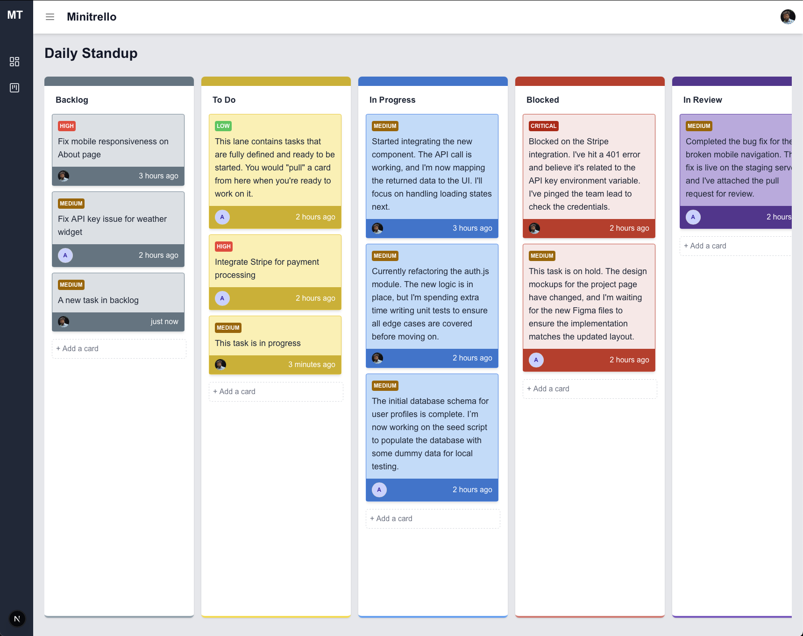

# Minitrello: The Simple Kanban Board

Minitrello is a responsive, utility-first Kanban board application designed to simplify task management for individuals and small teams. It allows users to visualize their workflow, track progress, and organize tasks across various stages (Backlog, To Do, In Progress, Done).

This project showcases a modern full-stack architecture focusing on real-time data handling, structured AI integration, and a highly interactive user interface built with React and Tailwind CSS.



## Features
- Firebase Authentication: Secure login using Google Sign-In or quick access via Anonymous Guest login.
- Real-time Data Sync: Uses Firestore to store card data, ensuring instant updates across all users or sessions.
- Intuitive Kanban UI: Responsive and draggable-friendly interface for moving tasks between lanes.
- Generate realistic, structured task ideas for a project.
- Utility-First Styling: Built entirely using Tailwind CSS for rapid development and consistent design across all breakpoints.

## Tech Stack
- React / Next.js
- Tailwind CSS
- Firebase Authentication
- Google Cloud Firestore

## Setup (Local)
To run this project locally, 
```bash
npm install
```